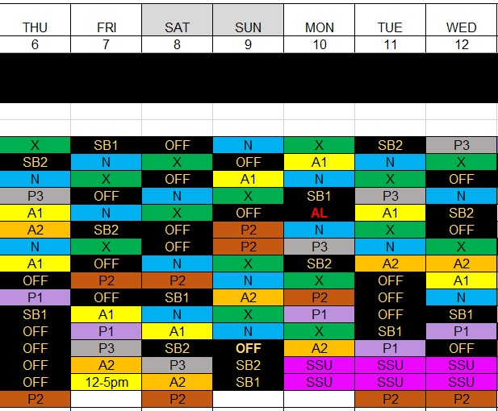
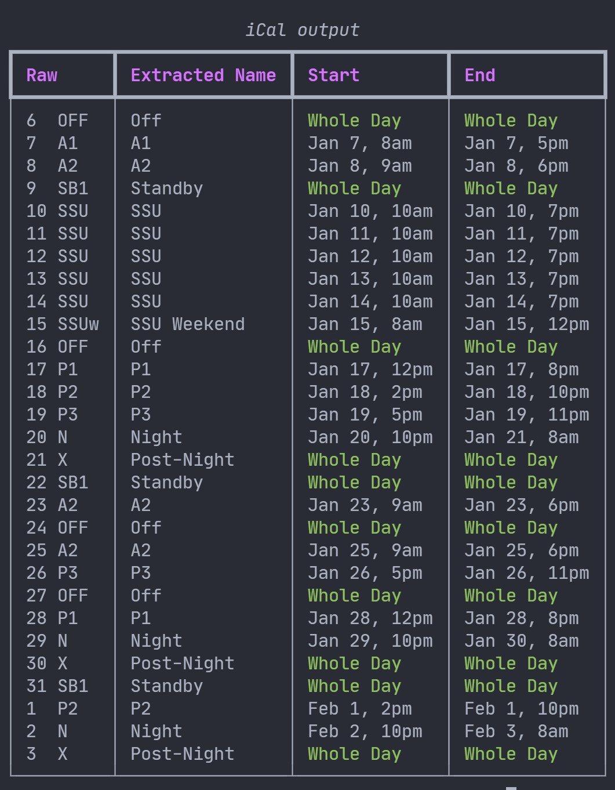

# IMH ES Roster to iCal Converter

This utility converts ES rosters in `.xlsx` to `.ical` files which can be imported into Google Calendar or any other client supporting the [iCalendar][icalendar] format.

*From this...*

*...to this*

## Usage

You need to have [Python][python] 3.10 or later installed before proceeding.

- Install requirements: `pip install -r requirements.txt`
- First, extract the schedule from the `.xlsx` file to JSON:
    - `python schedule_to_json.py <ROSTER_FILE> --name <NAME>` where `<NAME>` is your name exactly as it appears in the roster with quotes, for example `'John Doe'`
- Then, export to iCal:
    - `python json_to_ical.py <JSON_FILE> --month=<MONTH>`
        - `<JSON_FILE>` is the path to the `roster.json` file generated in teh previous step
        - `<MONTH>` is the month as an integer, where `Jan=1`, `Feb=2` etc.

[icalendar]: https://icalendar.org/
[python]: https://www.python.org/downloads/